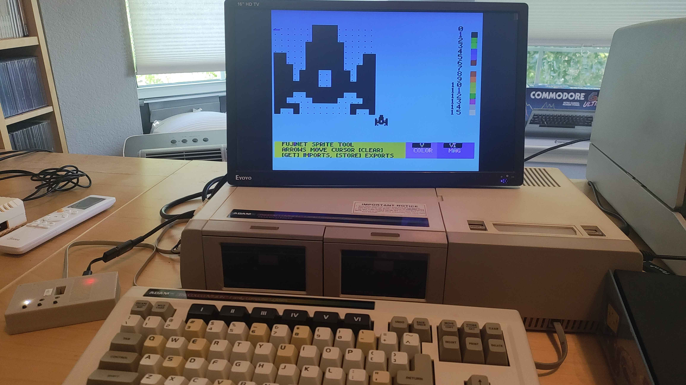

# FujiNet Sprite Tool

A TMS9918A sprite editor for the Coleco Adam, compiled with [Z88DK](https://github.com/z88dk/z88dk). Design, preview, import, and export sprites directly on the hardware using the Adam's SmartWriter UI and a [FujiNet](https://fujinet.online/) network adapter.

Featured in the **June 2026 issue of [Compute!'s Gazette](https://www.computesgazette.com/)**.



---

## Features

- **Full-screen pixel editor** — 16×16 editing canvas mapped to TMS9918A sprite format, displayed as a grid of characters with live preview rendered as an actual hardware sprite in the corner of the screen.
- **TMS9918A sprite modes** — toggle between 8×8, 16×16, and magnified (2×) sprite sizes with a single key press.
- **16-colour palette** — cycle through all 16 TMS9918A colours; a colour swatch strip is displayed on the right side of the screen.
- **Toggle pixels** — move the cursor over any pixel and press **SPACE** to flip it on or off.
- **Network import/export** via FujiNet — load and save raw sprite data over any FujiNet-supported URL (e.g. `N:TCP://192.168.1.x/`).
- **Clear** — wipe the sprite canvas with a single key press.
- **Joystick support** — the directional joystick moves the cursor (with auto-repeat), and the fire button acts as RETURN during text entry.
- **SmartKeys UI** — command labels displayed in the Adam's native SmartWriter style at the bottom of the screen.

---

## Controls

| Key | Action |
|---|---|
| Arrow keys / Joystick | Move cursor |
| SPACE | Toggle pixel (plot/erase) |
| SmartKey V | Cycle sprite colour |
| SmartKey VI / Joystick `*` | Toggle sprite magnification (8×8 → 16×16 → 2×) |
| GET | Import sprite data from a FujiNet network URL |
| STORE | Export sprite data to a FujiNet network URL |
| CLEAR | Clear the sprite canvas |

---

## Network Import / Export

When you press **GET** or **STORE**, you are prompted to enter a FujiNet network URL, for example:

```
N:TCP://192.168.1.50/
```

Raw sprite data (32 bytes for a 16×16 sprite) is read from or written to the network device. Any FujiNet-supported protocol may be used.

---

## Building

### Prerequisites

- [Z88DK](https://github.com/z88dk/z88dk) with the `z80' new library backend
- [eoslib](https://github.com/tschak909/eoslib) — Z88DK bindings for the Coleco Adam EOS
- [smartkeyslib](https://github.com/tschak909/smartkeyslib) — Adam SmartWriter-style UI library for Z88DK
- [fujinet-lib](https://github.com/FujiNetWIFI/fujinet-lib) — FujiNet network library (fetched automatically by the build system)
- Python 3 (required by the MekkoGX build scripts)

Install eoslib and smartkeyslib by following the instructions in their respective repositories (copy the `.lib` file to `$Z88DK/lib/clibs/` and the `.h` header to `$Z88DK/include/`).

### Compile

```sh
make adam
```

Build artefacts are placed under `r2r/adam/`.

The project uses the [MekkoGX](https://github.com/fozzTexx/MekkoGX) cross-platform Makefile framework. `FUJINET_LIB` is resolved automatically to the latest available release; set it explicitly in `Makefile` if you need a specific version.

---

## Project Structure

```
src/           Platform-independent source
src/adam/      Coleco Adam platform implementation
mekkogx/       MekkoGX build framework (submodule)
_cache/        Downloaded FujiNet library cache (generated)
```

---

## Dependencies

| Library | Purpose |
|---|---|
| [eoslib](https://github.com/tschak909/eoslib) | Coleco Adam EOS system calls (keyboard, VDP, game controllers, file I/O) |
| [smartkeyslib](https://github.com/tschak909/smartkeyslib) | Adam SmartWriter-style SmartKeys status bar and sound |
| [fujinet-lib](https://github.com/FujiNetWIFI/fujinet-lib) | FujiNet network open/read/write/close primitives |
| [MekkoGX](https://github.com/fozzTexx/MekkoGX) | Cross-platform retro build framework |
| [Z88DK](https://github.com/z88dk/z88dk) | Z80 C compiler and standard library (`video/tms99x8.h`, `conio.h`, `msx.h`) |

---

## License

GNU General Public License v3.0 — see [LICENSE](LICENSE) for details.

---

## Author

Thomas Cherryhomes &lt;thom.cherryhomes@gmail.com&gt;
